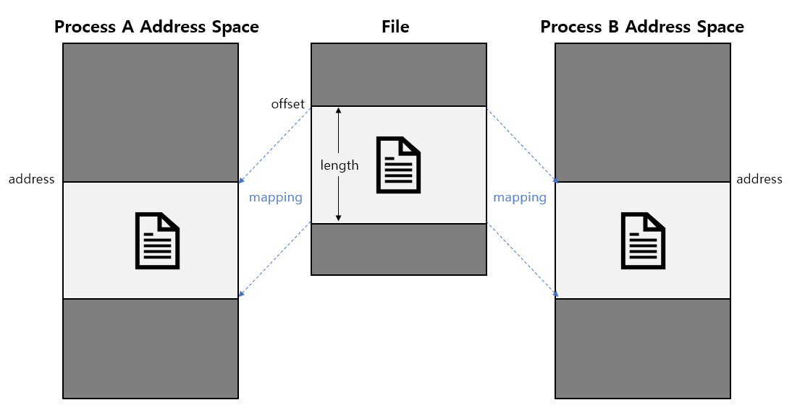

# Linux IPC Programming
## Shared Memory
### File-Memory Mapping
#### 정의
**파일 내 데이터를 메모리에 복사하고 해당 데이터를 다수의 프로세스가 공유**

#### 매커니즘
1. 파일 내 메모리에 매핑할 데이터의 초기 offset 확인
2. 해당 데이터의 length를 확인
3. 메모리에 파일 내 데이터의 초기 offset부터 length만큼 데이터를 복사(copy)
4. 메모리에 복사된 데이터를 다수의 프로세스가 공유
  - 특정 프로세스에서 해당 파일 데이터를 변경 시 다른 프로세스도 변경 사항을 자동 동기화
  - Shared Memory 매핑 방식  
  

#### Memory Mapping API  
1. void *mmap(void *addr, size_t length, int prot, int flags, int fd, off_t offset)  
: **특정 또는 익명의 파일에 대해 메모리 할당**

**[파라미터]**
- address : 메모리에 매핑될 주소 (NULL로 넘기면 커널에서 임의로 매핑)
- length : 매핑할 데이터의 길이
- prot : 메모리에 데이터를 매핑하면서 커널에게 어떤 권한을 요청할지 명시
  - PROT_EXEC : execute only
  - PROT_READ : read only
  - PROT_WRITE : write only
  - PROT_NONE : none
- flags
  - MAP_SHARED : SHARED Mapping 방식으로 진행
  - MAP_PRIVATE : 거의 사용 X
  - MAP_FIXED : address값을 직접 지정할 때 사용
  - MAP_ANONYMOUS : 익명 파일로 매핑 시 사용
- fd : 매핑할 파일의 fd
  - `익명 파일`을 매핑할 경우 -1로 설정
- offset : 파일 내 매핑할 데이터의 시작점
  - 반드시 page 크기의 배수가 되어야 한다.
  - `익명 파일`을 매핑할 경우 해당 offset 값은 무시됨

**[반환값]**
- 성공 시 메모리에 매핑된 주소
- 실패 시 MAP_FAILED

2. int munmap(void *addr, size_t length);  
: **메모리 할당 해제**

**[파라미터]**
- address : 메모리에 매핑된 주소
- length : 매핑된 데이터의 길이

**[반환값]**
- 성공 시 0
- 실패 시 -1

#### 파일을 메모리에 매핑하는 방식
1. 특정 파일을 매핑
2. 익명 파일을 매핑

| 종류 | 특정 파일을 매핑 | 익명 파일을 매핑 |
|:---:|:---:|:---:|
| 정의 | 특정 파일을 mmap() | 익명의 파일로 mmap() |
| 특징 | mmap() 호출 시 flag에 `MAP_SHARED flag`를 포함 | mmap() 호출 시 flag에 `MAP_SHARED`와 `MAP_ANONYMOUS` flag를 포함 |
|      | 파일 I/O가 발생 | 파일 I/O가 발생하지 않음 |
| 장점 | unrelated process 간 shared memory 생성 가능 | 성능이 좋음 |
| 단점 | 성능이 좋지 않음 | 매핑 이후 fork()된 related process 간에만 공유 가능 |
